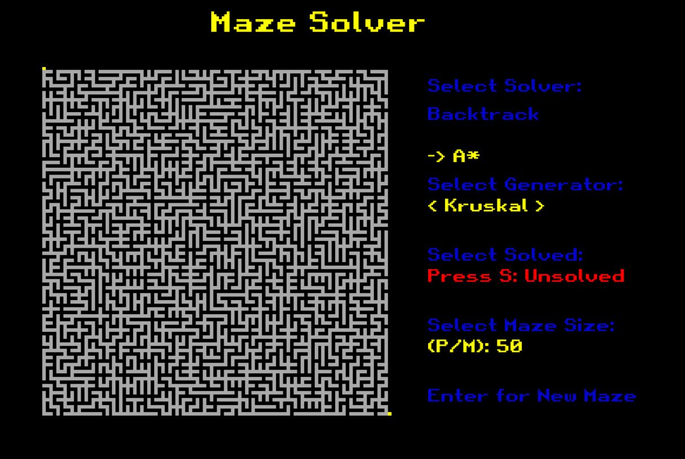
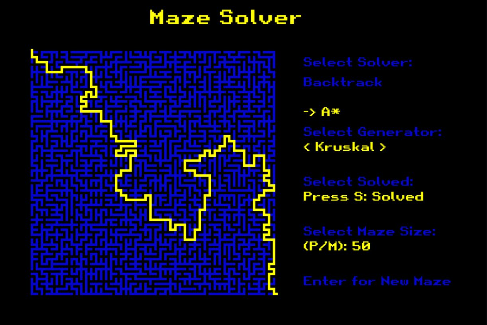

Certainly, here's a README template based on the information you provided:

```markdown
# Maze Generator and Solver

This project utilizes a graphical user interface (GUI) to generate mazes in a text file using backtracking and Kruskal's algorithm. Additionally, it includes a solver that employs a backtracking algorithm and the A* search algorithm, inspired by a video by [Sebastian Lague](https://www.youtube.com/watch?v=-L-WgKMFuhE).

## Requirements

Make sure you have the following dependencies installed to run the project:

- Pygame (version 2.4.0)
- Pillow (version 9.5.0)

You can install the required dependencies by running the following command:

```bash
pip install -r requirements.txt
```

## Usage

To use the maze generator and solver, follow these steps:

1. Simply run the script on main.py

2. Everything should be self-explanatory from there (I added instructions to the GUI :D)

### Some screenshots




### Maze Generation

 - Tweak around and press ENTER to generate a maze
 - If you're interested in how it works, it is based on Kruskal's algorithm and backtracking
 - Reading the code should be enough to understand how it works (There's even some explanatory comments)

## URL Reference

- [Sebastian Lague Video](https://www.youtube.com/watch?v=-L-WgKMFuhE&list=PLFt_AvWsXl0cq5Umv3pMC9SPnKjfp9eGW) (Add the actual URL to the Sebastian Lague video)
